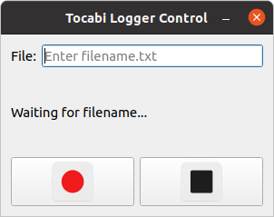

# Tocabi Logger

A ROS (ROS1 Noetic) package for logging shared memory data to text files, controlled via a Qt-based Python GUI. Users can enter a filename, start/stop recording with dedicated buttons, and see status updates in real-time.

## Features
<p align="center">
  
</p>

- **Data Logging Node** (`tocabi_logger_node`)
  - Subscribes to shared memory and logs specified fields to a text file.
  - Controlled via ROS topics: filename and start/stop toggle.
  - Publishes status messages (`Data saving...`, elapsed time, `Data saved!`).

- **GUI Control** (`record_gui.py`)
  - Qt5-based interface with:
    - Filename input field
    - Record, Stop buttons with icons
    - Status label for live feedback and elapsed time
  - Publishes:
    - `/tc_rec/record_filename` (`std_msgs/String`)
    - `/tc_rec/is_logging` (`std_msgs/Bool`)
  - Subscribes:
    - `/tc_rec/logger_status` (`std_msgs/String`)

## Installation

1. Clone into your catkin workspace:

   ```bash
   git clone https://github.com/yongarry/tocabi_logger.git
   ```

## Usage

### Method 1. Launch ROS Launch

```bash
roslaunch tocabi_logger tocabi_record.launch
```

### Method 2. Add this line to realrobot.launch or simulation.launch

```xml
<include file="$(find tocabi_logger)/launch/tocabi_record.launch"/>
```

### Control Recording

- Enter desired output filename (e.g. `motion1.csv`) in the GUI.
- Click the **Record** button ▶️ to start logging. Status updates will display elapsed time.
- Click the **Stop** button ⏹ to cease logging. The GUI will show `Data saved!`.

### 5. Recorded Files

Logged files are written to the path provided (default: `/home/<user>/data/<filename>`).
or you can change the directory

## File Structure

```text
 tocabi_logger/             # package root
 ├── CMakeLists.txt         # catkin build definitions
 ├── package.xml            # package metadata
 ├── src/                   # C++ source
 │   └── main.cpp           # logger node implementation
 ├── include/tocabi_logger/
 │   └── tocabi_data.h      # shared memory reader + logger class
 ├── scripts/               # Python scripts
 │   ├── record_gui.py      # Qt GUI controller
 │   └── icons/             # button and window icons
 │       ├── rec.png
 │       ├── stop.png
 │       ├── tocabi_rec.png
 │       └── gui.png
 └── launch/                # optional launch files
     └── tocabi_record.launch
```

## Troubleshooting
- **Missing permissions**: Make `record_gui.py` executable:
  ```bash
  chmod +x src/tocabi_logger/scripts/record_gui.py
  ```
